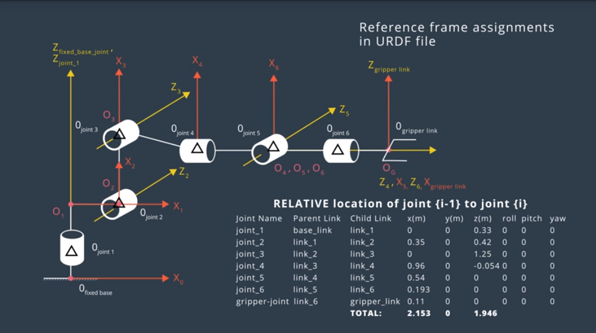
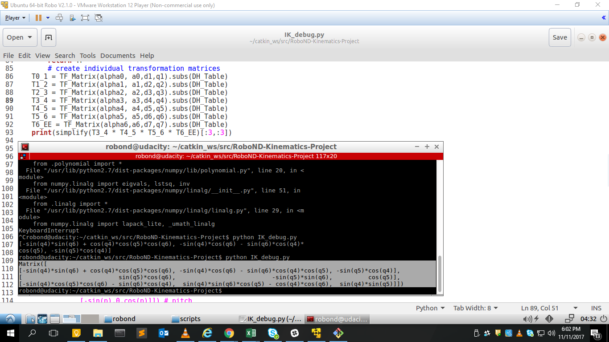
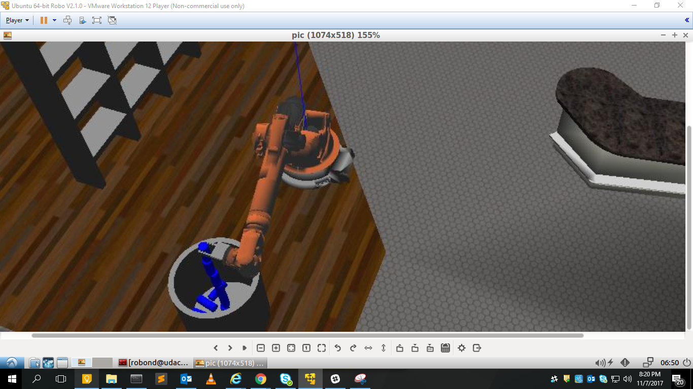

## Project: Kinematics Pick & Place

## [Rubric](https://review.udacity.com/#!/rubrics/972/view) Points
### Here I will consider the rubric points individually and describe how I addressed each point in my implementation.  


### Kinematic Analysis

#### 1. Run the forward_kinematics demo and evaluate the kr210.urdf.xacro file to perform kinematic analysis of Kuka KR210 robot and derive its DH parameters.

Ans: The schematics of the 6 joints looks like: 



And the table is 

| Links | alpha(i-1) | a(i-1) | d(i-1) | theta(i)   |
| ----- | ---------- | ------ | ------ | ---------- |
| 0->1  | 0          | 0      | 0.75   | qi         |
| 1->2  | - pi/2     | 0.35   | 0      | -pi/2 + q2 |
| 2->3  | 0          | 1.25   | 0      | q3         |
| 3->4  | - pi/2     | -0.054 | 1.5    | q4         |
| 4->5  | pi/2       | 0      | 0      | q5         |
| 5->6  | -pi/2      | 0      | 0      | q6         |
| 6->EE | 0          | 0      | 0.303  | 0          |

Child joint and its parent joints positional relation is shown in kr210.urdf.xacro file .Each joint is defined relative to its parent. The choice of x-y-z axis for each frame follows the rules of minimizing the number of non-zero parameters. In th above pic black triangles indicate the origin of joint frames.
For example,to get from joint 1 to joint 2 you have to transulate 0.35 meters in the x direction and 0.42m in the z direction.
And select the d and a to reduce the non zero parameters.The orentation of the arm may not be the same as the urdf file , so intially we try to take all the angles to be zero if not for example theta2 , is the angle between x(i-1) to x(i) along the z(i) axis in right hans sense , since x(i-1) and x(i) are not parallel , so there is a -90deg constant offset,which should be considered.


#### 2. Using the DH parameter table you derived earlier, create individual transformation matrices about each joint. In addition, also generate a generalized homogeneous transform between base_link and gripper_link using only end-effector(gripper) pose.

Ans: Individual tranformation matrices for each joint using forward kinematics:

```python

def TF_Matrix(alpha,a,d,q):
    TF = Matrix([[cos(q), -sin(q), 0, a],
        [sin(q)*cos(alpha),cos(q)*cos(alpha),-sin(alpha),-sin(alpha)*d], 
        [sin(q)*sin(alpha),cos(q)*sin(alpha), cos(alpha), cos(alpha)*d],
                 [0, 0, 0,1]                  ])
    return TF
# create individual transformation matrices
T0_1 = TF_Matrix(alpha0, a0,d1,q1).subs(DH_Table)
T1_2 = TF_Matrix(alpha1, a1,d2,q2).subs(DH_Table)
T2_3 = TF_Matrix(alpha2, a2,d3,q3).subs(DH_Table)
T3_4 = TF_Matrix(alpha3, a3,d4,q4).subs(DH_Table)
T4_5 = TF_Matrix(alpha4, a4,d5,q5).subs(DH_Table)
T5_6 = TF_Matrix(alpha5, a5,d6,q6).subs(DH_Table)
T6_EE = TF_Matrix(alpha6,a6,d7,q7).subs(DH_Table)

```

An homogenous transform between based link and end-effector:

$$^{N}T_{0} = ^{1}T_{0} * ^{2}T_{1} * ^{3}T_{2} .... ^{N}T_{N-1}$$

#### 3. Decouple Inverse Kinematics problem into Inverse Position Kinematics and inverse Orientation Kinematics; doing so derive the equations to calculate all individual joint angles.

The designof spherical wrist **kinematically decouples the position and orientation** of the end effector. So the problem is divided into 2  basic steps.

So if we observe the first 3 joints take care of the transulational position of the wrist center and the rest takes care of the orientation of the end effector. By knowing the end effector position we can get the position of the WC.

The location of the wrist center (WC) and end effector (EE) relative to the base frame "0" is given by, 
$^0r_{WC/0}$ and $^0r_{EE/0}$, respectively. The location of the EE relative to the WC is given by, 
$^0r_{EE/WC}$

$^6r_{EE/WC}$ is in the frame 6. The frame EE is oriented  so these two align (same orientation) and $^6r_{EE/WC}$ simply an offest of d along negitive z axis.

$^0r_{EE/0}$ is the position of end effector and $^0_6R$ can be directly calculated from the orientation of the end effector, i.e. euler angle (roll, pitch,yaw).


``` python

        r, p, y = symbols('r p y')
        ROT_x = Matrix([[1, 0, 0],
           [0,cos(r),-sin(r)],
           [0,sin(r),cos(r)]]) # Roll        
        ROT_y = Matrix([[cos(p), 0, sin(p)],
                        [0,      1,   0],
                        [-sin(p),0,cos(p)]]) # pitch
        ROT_z = Matrix([[cos(y), -sin(y), 0],
                        [sin(y),  cos(y), 0],
                        [     0,       0, 1]]) # yaw
        ROT_EE = ROT_z *ROT_y * ROT_x
        #Because the coordinate between URDF in ROS and DH convention are different, some correction should be applied to bring
        #the R0_EE calculated by applying Euler matrices to DH orientation:
        Rot_Error = ROT_z.subs(y,radians(180)) *ROT_y.subs(p,radians(-90))
        
        ROT_EE = ROT_EE *Rot_Error

        px = req.poses[x].position.x
        py = req.poses[x].position.y
        pz = req.poses[x].position.z
        WC = EE - 0.303 * ROT_EE[:,2]

```


By knowing WC, and from the image below we can calculate the theta1,theta2,theta3 by projecting the first 3 joint links in to yz or xy plane.
For calculating theta1 simple trignomerty can be used. 


``` python
 theta1 = atan2(WC[1],WC[0])
```
For calculating theta2 and theta3:

``` python

            side_a = 1.501
            side_b = sqrt(pow((sqrt(WC[0] *WC[0] + WC[1]*WC[1])-0.35),2) +
                              pow((WC[2]-0.75),2))
            side_c = 1.25
            
            angle_a = acos((side_b*side_b + side_c*side_c -side_a*side_a)/(2*side_b*side_c))
            angle_b = acos((side_a*side_a + side_c*side_c -side_b*side_b)/(2*side_a*side_c))
            angle_c = acos((side_a*side_a + side_b*side_b -side_c*side_c)/(2*side_a*side_b))
            
            theta2 =  pi/2 - angle_a -atan2(WC[2] - 0.75, sqrt(WC[0] *WC[0] +WC[1]*WC[1]) - 0.35)
            theta3 =  pi/2 - (angle_b + 0.036) # 0.036 is sag in link4 of -0.054m
            
```
Calculation of theta3 ,Top down view:


To find WC orientaion of EE with respect to joint3, we compare the R3_EE with the given roll pitch and yaw orientaion to the symbolic from transformation matrix. 
``` python
   R0T_EE = R0_1*R1_2*R2_3*R3_4*R4_5*R5_6*R6_EE = R0_3*R3_4*R4_5*R5_6*R6_EE
   
   R0_3.inverse()*R0T_EE = R0_3.inverse()*R0_3*R3_4*R4_5*R5_6*R6_EE
   
   R0_3.inverse()*R0T_EE = I*R0_3*R3_4*R4_5*R5_6*R6_EE = R0_3*R3_4*R4_5*R5_6*R6_EE
   
   since 
   R3_6 = R3_4*R4_5*R5_6*R6_EE
   therefore
   R3_6 = R0_3.inverse()*R0_EE
   #And R0_3 is given by:
   R0_3 = T0_1[0:3,0:3] * T1_2[0:3,0:3] * T2_3[0:3,0:3]
   R0_3 = R0_3.evalf(subs= {q1:theta1, q2:theta2, q3:theta3})            
```            


With these 3 angles, calculate the $^0_3R$, then get $^3_6R$, the remaining angles can be calculated by the matrix element.

```python
R3_6 = R0_3.inv("LU") * ROT_EE
#And symbolically
T3_6=simplify(T3_4 * T4_5 * T5_6 * T6_EE)
R3_6=T3_6[:3,:3]
'''
print(simplify(T3_4 * T4_5 * T5_6 * T6_EE)[:3,:3]

Matrix([
[-sin(q4)*sin(q6) + cos(q4)*cos(q5)*cos(q6), -sin(q4)*cos(q6) - sin(q6)*cos(q4)*cos(q5), -sin(q5)*cos(q4)],
[                           sin(q5)*cos(q6),                           -sin(q5)*sin(q6),          cos(q5)],
[-sin(q4)*cos(q5)*cos(q6) - sin(q6)*cos(q4),  sin(q4)*sin(q6)*cos(q5) - cos(q4)*cos(q6),  sin(q4)*sin(q5)]])

'''
theta4 =tan inverse of(sin(q4)*sin(q5)/-sin(q5)*cos(q4)) 

theta5 =tan inverse of(sqrt( (-sin(q5)*cos(q4))**2+(sin(q4)*sin(q5))**2)/(-sin(q5)*sin(q6)))

theta6 =tan inverse of(-sin(q5)*sin(q6)/sin(q5)*cos(q6))
#From the above 3 equations if we simplyfy we are getting the angles, only that matters is the sign or the theta value may be higher than #2pi which may lead to rotaions,so as suggested by jafar_abdi in slack.

 theta5 = atan2(sqrt(R3_6[0,2]*R3_6[0,2] + R3_6[2,2]*R3_6[2,2]),R3_6[1,2])
	    if sin(theta5) < 0:
		    theta4 = atan2(-R3_6[2,2], R3_6[0,2])
		    theta6 = atan2(R3_6[1,1], -R3_6[1,0])
	    else:
		    theta4 = atan2(R3_6[2,2], -R3_6[0,2])
		    theta6 = atan2(-R3_6[1,1], R3_6[1,0])
```
#### Hence all the theta values are derived.

### Project Implementation

#### 1. Fill in the `IK_server.py` file with properly commented python code for calculating Inverse Kinematics based on previously performed Kinematic Analysis. Your code must guide the robot to successfully complete 8/10 pick and place cycles. Briefly discuss the code you implemented and your results. 



first we have a service called "calculate_ik" is send to `handle_calculate_IK` function to process the request.
Within the function, create symbols and DH parameter dictionary for KR 210, define Transfomration matrix and call it for each joint, calculate the rotation maxtrix using position and orientation of the end effector.We calculate the wrist centreand all the 6 angles using inverse kinematics and push it into the joint_trajectory_list.

Code guides the robot but its very slow with a RAM of 6gb and 4 core processors.it has completed 10/10 pick and place as shown in the image above.


